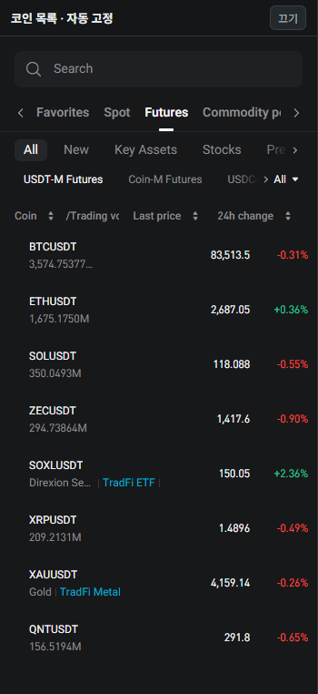

# Bitget Left Market

비트겟 USDT 선물 화면의 기존 종목 목록을 **350px 왼쪽 사이드바**로 고정하는 비공식 Chrome Manifest V3 확장입니다.

**개인 사용에서 출발한 초기 베타(v1.0.1)**입니다. Bitget 공식 제품이 아니며, Bitget과 제휴하거나 보증을 받지 않았습니다. 매매 자동화 도구나 투자 추천 도구가 아닙니다.

## 화면

실제 동작 화면 중 공개 시세 목록만 촬영했습니다. 계정·잔고·주문·포지션은 포함하지 않았으며, 개인 즐겨찾기 표시는 공개 이미지에서만 가림 처리했습니다. 시세는 촬영 시점의 값입니다.

## 기능

- 별도의 시세 API 대신 Bitget이 제공하는 기존 종목 목록을 재사용
- 기존 검색·실시간 가격 표시·종목 선택 기능 유지
- 왼쪽 목록 폭 350px, 본문을 오른쪽으로 이동
- 페이지가 동적으로 바뀌면 목록을 다시 고정하도록 DOM 변화 감지
- 새로고침·새 탭에서 자동 적용
- 페이지의 **끄기** 버튼과 확장 팝업의 설정으로 활성화 상태 변경
- 설정은 브라우저 로컬 저장소에만 보관

## 무료 설치

이 프로젝트는 Chrome Web Store에 등록되어 있지 않습니다. 개발자 모드로 설치합니다.

1. 저장소 오른쪽 **Releases**에서 최신 버전의 `bitget-left-market-v1.0.1.zip`을 다운로드합니다. 또는 **Code → Download ZIP**을 사용합니다.
2. ZIP을 압축 해제하고, `manifest.json`이 있는 폴더를 찾습니다.
3. Chrome 주소창에 `chrome://extensions`를 입력합니다.
4. 오른쪽 위 **개발자 모드**를 켭니다.
5. **압축해제된 확장 프로그램을 로드합니다**를 누르고 2번 폴더를 선택합니다.
6. 지원되는 Bitget USDT 선물 페이지를 열거나 새로고침합니다.

설치 폴더는 삭제하거나 이동하지 마세요. Chrome의 확장 퍼즐 아이콘에서 이 확장을 고정하면 설정을 쉽게 열 수 있습니다. 브라우저나 회사 정책에 따라 개발자 모드 설치가 제한될 수 있습니다.

## 지원 범위

현재 manifest에 등록된 주소만 지원합니다.

- `https://www.bitget.com/asia/futures/usdt/*`
- `https://www.bitget.com/futures/usdt/*`

콘텐츠 스크립트는 그중 종목명이 있는 USDT 선물 경로에서만 UI를 고정합니다. 다른 지역·언어 경로나 현물·Coin-M 화면은 지원하지 않습니다.

## 켜기 / 끄기 / 제거

- **끄기:** 사이드바 상단의 끄기 버튼 또는 확장 팝업 체크 해제
- **다시 켜기:** 확장 아이콘 → 자동 고정 체크
- **제거:** `chrome://extensions`에서 제거한 뒤 Bitget 페이지 새로고침

## 권한 및 개인정보

명시적 API 권한은 `storage` 하나입니다. 콘텐츠 스크립트는 위 두 주소 패턴의 페이지 DOM에 접근하여 목록과 레이아웃을 변경합니다.

확장 코드에는 외부 서버 요청, 분석 도구, 주문 실행, 잔고·포지션·로그인 정보 수집 로직이 없습니다. Bitget 사이트 자체의 통신과 데이터 처리는 이 확장과 별개입니다. 자세한 내용은 [PRIVACY.md](PRIVACY.md)를 확인하세요.

## 기술 구성

| 파일 | 역할 |
| --- | --- |
| `manifest.json` | MV3, 적용 경로, storage 권한, 팝업 정의 |
| `content.js` | 기존 목록 탐색, CSS 고정, DOM 변화 감지, 원복 |
| `popup.html` / `popup.js` | 활성화 설정 UI 및 로컬 저장 |
| [PORTFOLIO.md](PORTFOLIO.md) | 문제 정의, 설계 선택, 구현 과정, 검증과 한계 |

JavaScript / HTML / CSS / Chrome Extensions API를 사용합니다. 빌드 도구, 외부 라이브러리, 백엔드는 없습니다.

## 검증과 알려진 한계

- 개발에 사용한 Chromium 기반 Aside 환경에서 목록 고정, 검색, 가격 갱신, 끄기/다시 켜기, 새로고침·새 탭 자동 적용을 확인했습니다.
- 일반 Chrome 전체 버전·운영체제·로그인 상태·반응형 화면 조합을 모두 검증한 것은 아닙니다.
- Bitget의 내부 CSS 클래스명과 DOM 구조에 의존하므로 사이트 개편 시 동작하지 않을 수 있습니다.
- 본문 최소 폭은 768px이며, 사이드바 350px와 함께 좁은 창에서 잘림 또는 가로 넘침이 발생할 수 있습니다.
- 지원하지 않는 경로에서 SPA 방식으로 진입하면 콘텐츠 스크립트가 삽입되지 않을 수 있으므로 페이지 새로고침이 필요할 수 있습니다.
- 폭 조절, 다른 언어 경로 지원, 자동 업데이트는 아직 제공하지 않습니다.
- 끄기는 확장이 추가한 스타일과 마커를 제거합니다. 정확한 원래 화면이 필요하면 끈 뒤 페이지를 새로고침하세요.

문제가 생기면 먼저 확장을 끄고 새로고침하세요. Issues에는 브라우저 버전, 화면 크기, 재현 방법을 적되 계정·잔고·포지션·인증 정보는 올리지 마세요.

## 수동 업데이트

새 ZIP을 다운로드하고 기존 설치 폴더의 파일을 교체한 뒤 `chrome://extensions`에서 확장 새로고침 버튼을 누르고 Bitget 페이지도 새로고침합니다. ZIP 설치 방식은 자동 업데이트되지 않습니다.

## 라이선스

[MIT](LICENSE). Bitget 명칭·상표·사이트 UI·시세 데이터의 권리는 해당 권리자에게 있습니다. 이 라이선스는 본 저장소의 확장 코드와 문서에 적용되며, 제3자 상표·데이터에 대한 권리를 부여하지 않습니다.
